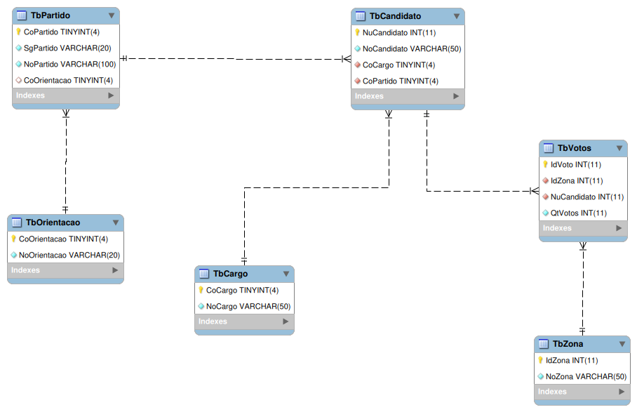

# Programação em Banco de Dados, Unidade 01 - Exercícios de Subconsulta

**INSTRUÇÕES:**

Execute o script em anexo para construir (e popular) o banco de dados.

**DIGRAMA ER:**

**QUESTÕES:**

1. Liste os nomes dos candidatos cujo partido possui orientação "Centro".
2. Liste os nomes dos partidos e as respectivas quantidades de candidatos associados.
3. Agora, liste apenas os partidos cuja a quantidade de candidatos associados seja maior que 5.
4. Selecione os candidatos que receberam mais votos do que a média de votos de todos os candidatos.
5. Mostre os candidatos que não receberam votos em nenhuma zona.
6. Liste os partidos que possuem, pelo menos, um candidato associado.
7. Agora, liste (se houver) os partidos que não há candidatos associados.
8. Liste os partidos que não possuem orientação política.